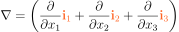
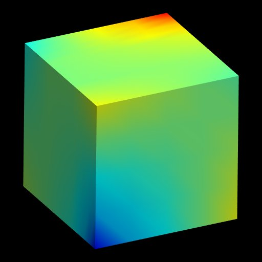

================
Laplace Equation
================

This example solves the weak form of the standard Laplace equation, 

|standard_laplace_equation| 

using the Galerkin Finite Element method. |phi| is a spatially varying scalar field (e.g. potential). |nabla| and |laplacian| are 'nabla' (divergence operator) and 'laplacian' (laplace operator) respectively and given by,

|nabla_equation|

|laplacian_equation|.

The generalised Laplace equation,

|generalised_laplace_equation|

where |conductivity_tensor| is the rank two, positive definite and symmetric conductivity tensor, can be reduced to the standard Laplace equation by setting |equation| (identity tensor).

Only Dirichlet boundary conditions are prescribed in this example.

   

   :align: middle   
   

   
.. |laplacian| image:: ./docs/images/laplacian.svg
   :align: middle
   

   

   

   

   

   

   :align: middle  
  
Building the example
====================

The fortran version of the example can be configured and built with CMake::

  git clone https://github.com/OpenCMISS-Examples/laplace_equation
  mkdir laplace_equation-build
  cd laplace_equation-build
  cmake -DOpenCMISSLibs_DIR=/path/to/opencmisslib/install ../laplace_equation
  make

This will create the example executable "laplace_equation" in ./src/fortran/ directory.

Running the example
===================

Fortran version::

  cd ./src/fortran/
  ./laplace_equation

Python version::

  cd ./laplace_equation/src/python
  source  /path/to/opencmisslibs/install/.../.../virtualenvironments/oclibs_pyXY_release/bin/activate
  python laplace_equation.py
  
  Note: If the above fails, try the following.
  cd ./laplace_equation/src/python
  PYTHONPATH="/path/to/opencmisslibs/install/.../.../Release/opencmiss.iron" python laplace_equation.py  

Verifying the example
=====================

Results can be visualised by running `visualise.cmgui <./src/fortran/visualise.cmgui>`_ with the `Cmgui visualiser <http://physiomeproject.org/software/opencmiss/cmgui/download>`_.

The following figure shows the finite element mesh (computational domain) and solutions (|phi| and |dphi_dn|).  
 

   :align: middle
   :width: 250
   :scale: 100
   

   :align: middle  
   :width: 250
   :scale: 100
   

   :align: middle  
   :width: 250
   :scale: 100   
   
    
|figure1a|  |figure1b|  |figure1c|

Figure 1. (a) Finite element mesh (b) Primary variable solution (c) Secondary variable solution
  
The expected results from this example are available in `expected_results <./src/fortran/expected_results>`_ folder.  
  
Prerequisites
=============

There are no additional input files required for this example as it is self-contained.

License
=======

License applicable to this example is described in `LICENSE <./LICENSE>`_.
